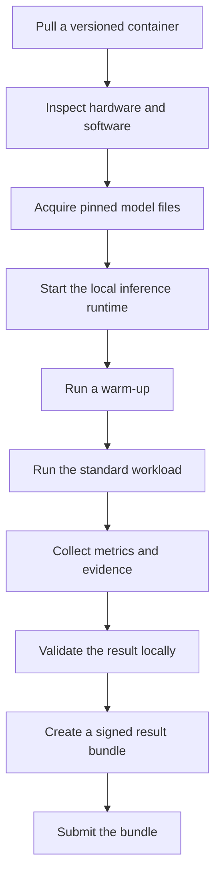
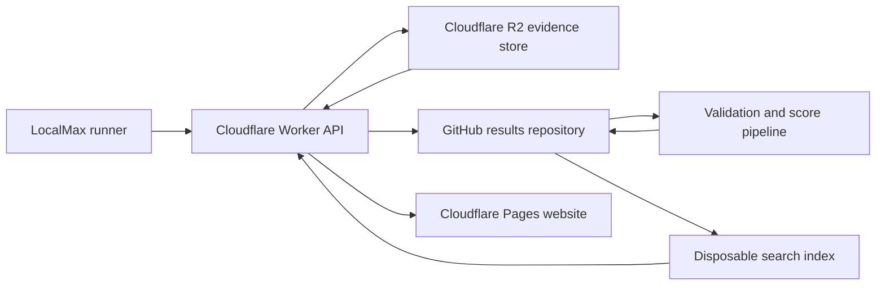

# LocalMax.net

## Open benchmarks for local AI

**Tagline:** Benchmark. Compare. Max out your local AI.

**Document status:** Product concept  
**Initial release:** Minimum viable product (MVP)  
**Website:** `localmax.net`

---

## 1. Executive summary

LocalMax is an open benchmark platform for local generative AI. It measures and compares inference performance on real user hardware.

LocalMax serves the same community need that popular graphics benchmarks served for custom gaming computers. Users can build a system, run a standard test, tune the system, and publish a result. Other users can compare the result with results from similar systems.

The first release has three benchmark categories:

1. **LocalMax LLM** for language models.
2. **LocalMax Vision** for vision-language models.
3. **LocalMax Diffusion** for image-generation models.

Each benchmark runs in a versioned container on the contributor's computer. The runner records the model, workload, hardware, software, configuration, performance, power use, and raw evidence. A public GitHub repository stores the accepted result manifests. Cloudflare Pages serves the website. Cloudflare Workers provides the API and submission service. Cloudflare R2 stores large evidence files.

The product is more than a leaderboard. It is an open, repeatable, and auditable benchmark protocol for local AI.

---

## 2. Product position

### 2.1 Product statement

> LocalMax is the open benchmark for local generative AI. It helps users compare LLM, vision-language, and diffusion performance across real enthusiast hardware.

### 2.2 Product promise

LocalMax gives users a trusted answer to a simple question:

> What can this hardware do with local AI?

### 2.3 Main users

- PC and workstation enthusiasts.
- Local AI users.
- Model and inference-runtime developers.
- Hardware reviewers.
- System builders and hardware vendors.
- Researchers who study practical inference performance.

### 2.4 Primary user needs

Users must be able to:

- Run a standard benchmark with a small number of commands.
- Compare hardware with the same model and workload.
- inspect raw performance data, not only a composite score.
- Show a system build and its tuning choices.
- Verify how a published result was produced.
- Repeat a test with the same benchmark version.

---

## 3. Product principles

### 3.1 Reproducible results

LocalMax pins each important test input. These inputs include the container version, model revision, quantization, workload, prompts, runtime, and scoring formula.

### 3.2 Evidence before claims

A result is a benchmark artifact. It is not a manually entered performance claim. Each submission includes machine-readable metrics and supporting evidence.

### 3.3 Raw data stays visible

LocalMax shows the composite score and the raw metrics. Expert users can inspect latency, throughput, memory use, power use, and configuration data.

### 3.4 Open implementation

The runner, workload definitions, result schema, validation rules, score formulas, and accepted manifests are open source.

### 3.5 Versioned comparisons

LocalMax compares results only when the benchmark rules are compatible. A major benchmark version creates a new leaderboard when a workload or score formula changes in a material way.

### 3.6 Clear trust levels

The website does not present all submissions as equally trustworthy. Each result has a visible verification level.

### 3.7 A focused first release

The MVP supports a small number of hardware and software configurations. This narrow scope reduces test variation and makes the first results useful.

---

## 4. Benchmark family

### 4.1 LocalMax LLM

LocalMax LLM measures language-model inference.

The initial profiles can include:

- **Compact:** An 8B-class model for common local systems.
- **Enthusiast:** A 30B-to-35B-class quantized model for high-end systems.
- **Extreme:** A 70B-class quantized model for large-memory systems.

Standard workloads can include:

- Interactive chat with one concurrent user.
- A coding task with a long input and a medium output.
- Throughput tests with 4, 8, and 16 concurrent users.
- A long-context test with a fixed context length.
- An optional maximum-throughput test.

Primary metrics:

- Time to first token.
- Inter-token latency.
- Output tokens per second.
- Total tokens per second.
- Requests per second.
- Median and 95th-percentile latency.
- Peak video memory use.
- Average and peak GPU power.
- Energy per generated token.
- Pass or fail against the profile latency limit.

### 4.2 LocalMax Vision

LocalMax Vision measures vision-language inference with a fixed image set and fixed prompts.

The initial workload can include:

- Image description.
- Optical character recognition.
- Chart interpretation.
- Document understanding.
- Visual reasoning.
- Multi-image reasoning.

Primary metrics:

- Requests per second.
- Time to first token.
- Output tokens per second.
- End-to-end latency.
- Peak video memory use.
- Energy per request.
- Answer-quality score, when the benchmark has a stable evaluation method.

Performance and answer quality are separate measurements. A fast but incorrect response must not receive the same status as a fast and correct response.

### 4.3 LocalMax Diffusion

LocalMax Diffusion measures image-generation inference.

Each profile fixes these inputs:

- Model and immutable model revision.
- Image width and height.
- Scheduler.
- Step count.
- Guidance scale.
- Seed set.
- Prompt set.
- Batch size.
- Precision and optimization settings.

The initial profiles can include:

- 1024 by 1024 text-to-image generation.
- Image-to-image generation.
- An optional high-resolution profile after the MVP.

Primary metrics:

- Images per minute.
- Median and 95th-percentile generation time.
- Peak video memory use.
- Average GPU power.
- Watt-hours per image.
- Output hash when the execution path is deterministic.
- An optional image-quality score.

Diffusion requires its own workload adapter. The platform must not force image generation into a token-based test model.

---

## 5. Containerized benchmark runner

The LocalMax website does not run the benchmark. The contributor runs it on the local computer.

LocalMax publishes three Open Container Initiative (OCI) images:

```text
ghcr.io/localmax-net/llm-benchmark
ghcr.io/localmax-net/vision-benchmark
ghcr.io/localmax-net/diffusion-benchmark
```

The containers share a common LocalMax runner. The runner has these functions:

```text
localmax-runner
├── inspect-system
├── acquire-model
├── start-inference-runtime
├── run-warm-up
├── run-workload
├── collect-telemetry
├── validate-result
├── package-evidence
└── submit-result
```

The language and vision adapters can use NVIDIA AIPerf where it is suitable. The diffusion adapter uses a workload and metric set that is specific to image generation.

### 5.1 Standard run sequence



### 5.2 Runner requirements

The runner must:

- Use pinned and verifiable dependencies.
- Record all settings that can affect a result.
- Preserve the raw benchmark output.
- Detect unsupported or changed configurations.
- Separate measured data from user-provided labels.
- Stop if required evidence is absent.
- Produce the same result schema for all categories.
- Never require a user's GitHub access token.

---

## 6. Result artifact

Each run produces a self-contained manifest and an evidence bundle.

The manifest includes:

- Schema and benchmark versions.
- Benchmark category and profile.
- Model repository, immutable revision, and quantization.
- GPU, CPU, memory, and storage information.
- Operating system, driver, runtime, and library versions.
- Workload and optimization settings.
- Raw and derived metrics.
- Telemetry summary.
- Evidence references and content hashes.
- Submitter identity or optional public alias.
- Runner signature and submission metadata.

Example structure:

```json
{
  "schema_version": "1.0",
  "benchmark": {
    "category": "llm",
    "profile": "enthusiast",
    "version": "1.0.0"
  },
  "model": {
    "repository": "publisher/model",
    "revision": "immutable-commit-hash",
    "quantization": "fp8"
  },
  "hardware": {
    "gpu": ["NVIDIA GeForce GPU"],
    "gpu_count": 1,
    "vram_bytes": 0,
    "cpu": "processor description",
    "memory_bytes": 0
  },
  "software": {
    "os": "operating system description",
    "driver": "driver version",
    "cuda": "CUDA version",
    "runtime": "inference runtime",
    "runtime_version": "runtime version"
  },
  "configuration": {},
  "metrics": {},
  "telemetry_summary": {},
  "artifacts": {},
  "submitter": {},
  "signature": {}
}
```

The manifest stores small, important facts. Cloudflare R2 stores large logs, telemetry traces, system reports, and sample images. Content hashes connect the manifest to these files.

---

## 7. Submission and publication

The public GitHub repository is the canonical source for accepted result manifests.

Suggested repository structure:

```text
results/
├── llm/
│   └── benchmark-version/model/gpu/result-id.json
├── vision/
│   └── benchmark-version/model/gpu/result-id.json
└── diffusion/
    └── benchmark-version/model/gpu/result-id.json
```

### 7.1 Submission flow

1. The runner creates the signed bundle.
2. The runner requests an upload session from a Cloudflare Worker.
3. The Worker issues limited upload URLs for Cloudflare R2.
4. The runner uploads the evidence bundle.
5. The Worker checks the schema, file size, benchmark version, content hashes, and one-time submission value.
6. A narrowly scoped GitHub App creates a pull request.
7. GitHub Actions performs deeper validation and calculates all official scores.
8. An automated rule or a maintainer accepts the valid result.
9. The website index updates after the manifest enters the main branch.

The runner does not write directly to the results repository. It does not store a contributor's GitHub token.

### 7.2 Validation controls

Validation can include:

- JSON schema checks.
- Signature and content-hash checks.
- Supported benchmark and model versions.
- Required raw files and telemetry.
- Plausible hardware and performance limits.
- Duplicate-run detection.
- Score recalculation from raw metrics.
- A scan for secrets and harmful file content.
- Manual review for records and unusual results.

The system must mark suspicious results for review. It must not silently change submitted measurements.

---

## 8. Verification levels

Each result has one of three verification levels.

### Community

The submission has a valid schema and comes from an approved runner version. Basic automated checks pass.

### Verified

The submission includes complete logs and telemetry. All automated checks pass. The evidence is consistent with the reported hardware, configuration, and metrics.

### Certified

An approved independent operator repeats the run or supervises it under a controlled process.

The website shows the verification level near every score. Users can filter leaderboards by level.

Verification reduces false claims, but it cannot prove that every community result is honest. LocalMax must state this limit clearly.

---

## 9. Scoring model

LocalMax publishes raw metrics and a small set of clear scores.

### 9.1 Scores

- **Interactive Score:** Gives more weight to time to first token and response latency.
- **Throughput Score:** Gives more weight to useful work per unit of time.
- **Efficiency Score:** Measures performance for each watt or unit of energy.
- **Capacity Score:** Shows the largest standard workload that the system completes.
- **LocalMax Overall:** Uses the geometric mean of normalized category scores.

### 9.2 Score rules

Each score formula must be:

- Public.
- Versioned.
- Deterministic.
- Reproducible from accepted raw metrics.
- Calculated by the validation pipeline.
- Independent of a submitter-provided score.

Results from incompatible major versions do not share a rank.

The benchmark team must select public reference values before it freezes a score version. It must publish those values with the formula. It must also test the formula against unusual hardware and failed workloads.

The overall score is useful for discovery and competition. It must not hide trade-offs. Each result page must give the same or greater visual importance to raw latency, throughput, memory, power, and quality data.

---

## 10. Cloudflare and GitHub architecture



### 10.1 Cloudflare Pages

Cloudflare Pages hosts:

- The landing page.
- Benchmark documentation.
- Category leaderboards.
- Hardware pages.
- Result detail pages.
- Comparison pages.
- Run and submission instructions.

### 10.2 Cloudflare Workers

Cloudflare Workers provides:

- Submission sessions.
- Schema and request validation.
- Signed R2 upload URLs.
- GitHub App integration.
- Result and leaderboard APIs.
- Abuse controls and rate limits.
- Search and filter access.

### 10.3 Cloudflare R2

Cloudflare R2 stores:

- Compressed raw logs.
- Telemetry traces.
- System reports.
- Diffusion sample images.
- Other large evidence files.

### 10.4 GitHub

GitHub stores the accepted manifests and the history of each change. GitHub Actions validates submissions and calculates official scores.

### 10.5 Optional index

A database such as Cloudflare D1 can provide fast filtering and ranking. This database is a disposable index, not the source of truth. The system can rebuild it from the accepted GitHub manifests.

---

## 11. MVP website

The first website needs these main views:

1. Overall leaderboard.
2. LLM, vision, and diffusion leaderboards.
3. Hardware page with all results for a GPU or system.
4. Result page with configuration, metrics, evidence, and verification status.
5. Comparison page for two to four systems.
6. Run and submission documentation.

Useful filters include:

- GPU model and count.
- Video memory.
- Model and quantization.
- Inference runtime.
- Operating system.
- Benchmark version.
- Verification level.
- Cooling type.
- Stock, tuned, or overclocked configuration.

The build and tuning fields support an enthusiast community. They must not affect the measured score unless the benchmark formula states this explicitly.

---

## 12. MVP scope

### 12.1 Included

- NVIDIA GPUs.
- Linux.
- Docker and NVIDIA Container Toolkit.
- Three pinned benchmark containers.
- One or two model profiles for each category.
- A shared runner and result schema.
- GitHub-based result review and publication.
- A Cloudflare-hosted leaderboard.
- Basic automated validation.
- Public raw results and evidence references.
- Community and Verified trust levels.

### 12.2 Deferred

- Native Windows execution.
- AMD, Intel, and Apple Silicon support.
- User accounts and social features.
- Comments and direct messaging.
- Paid certified runs.
- Formal overclocking competitions.
- Broad model-quality competitions.
- Audio, speech, music, and video generation.
- Vendor-specific private result programs.
- A mobile application.

The architecture must permit these additions. The MVP must not implement them before the core benchmark is stable.

---

## 13. Security and trust boundaries

The local runner collects sensitive system information. It must show users what it will collect before submission. It must remove local paths, user names, environment secrets, host names, and unrelated process data by default.

The service must apply these controls:

- Least-privilege permissions for the GitHub App.
- Limited and short-lived R2 upload URLs.
- Strict file type and file size limits.
- No execution of submitted files in a trusted environment.
- Isolation for validation jobs that parse untrusted data.
- Rate limits and abuse detection.
- Content hashes for all evidence.
- A retention policy for large artifacts.
- A process to report and remove exposed secrets or personal data.
- An audit log for changes to validation status.

A digital signature proves that a specific runner created a bundle. It does not prove that the local computer or operator was honest. Verification levels and evidence checks address this remaining risk.

---

## 14. Operations and measurement

LocalMax must measure product health and benchmark health.

### 14.1 Product metrics

- Successful benchmark runs per week.
- Submission completion rate.
- Accepted results per category.
- Repeat contributors.
- Leaderboard and comparison use.
- Time from upload to publication.

### 14.2 Benchmark quality metrics

- Run-to-run variance on reference systems.
- Validation failure rate and failure reason.
- Percentage of results with complete evidence.
- Percentage of results at each verification level.
- Number of disputed or removed results.
- Runtime and model coverage.
- Score distribution by hardware class.

### 14.3 Reliability targets

The team must define targets for:

- API availability.
- Submission durability.
- Index rebuild time.
- Validation queue time.
- Evidence retrieval success.
- Recovery from a failed deployment.

GitHub remains the recovery source for accepted manifests. R2 retention and backup rules protect the larger evidence files.

---

## 15. Open-source project structure

Suggested repositories:

```text
github.com/localmax-net/localmax
github.com/localmax-net/benchmarks
github.com/localmax-net/results
github.com/localmax-net/containers
```

The project can start with fewer repositories if one repository makes development easier. Separate repositories become useful when release cycles, permissions, or artifact sizes are different.

Suggested ownership:

- `localmax`: Website, Worker API, schemas, and documentation.
- `benchmarks`: Workload definitions, score formulas, and validation rules.
- `results`: Accepted manifests only.
- `containers`: Container build definitions and release automation.

Each benchmark release must include release notes, compatibility rules, model licenses, content hashes, known limits, and a defined support period.

---

## 16. Delivery plan

### Phase 0: Protocol prototype

- Select one LLM profile.
- Define the first result schema.
- Build one local runner path.
- Test repeatability on a small set of reference systems.
- Publish raw results without a composite score.

**Exit condition:** The same system produces stable results, and an independent user can repeat the test.

### Phase 1: MVP

- Release one profile for each benchmark category.
- Add Worker submission and R2 evidence upload.
- Add GitHub validation and publication.
- Launch category leaderboards and result pages.
- Publish the first versioned score formulas.

**Exit condition:** External users can run, submit, validate, and compare results without manual database changes.

### Phase 2: Community growth

- Add more model and workload profiles.
- Add hardware and result comparison tools.
- Add public contributor profiles.
- Add tuning and cooling classifications.
- Improve fraud and anomaly detection.

**Exit condition:** The platform has useful coverage across common enthusiast hardware and repeat contributors.

### Phase 3: Platform expansion

- Add AMD, Intel, and Apple Silicon paths.
- Add native Windows and macOS runners where containers are not suitable.
- Add Certified results.
- Add audio and video benchmark categories.
- Add vendor and reviewer integrations.

**Exit condition:** LocalMax supports multiple hardware ecosystems without loss of benchmark clarity or trust.

---

## 17. Main risks and controls

| Risk | Effect | Primary control |
|---|---|---|
| Users change the workload | Results are not comparable | Signed, pinned profiles and evidence checks |
| Hardware data is false | Leaderboard trust decreases | Telemetry checks, anomaly review, and verification levels |
| A model or runtime changes | Old and new results mix | Immutable revisions and benchmark versions |
| One score hides trade-offs | Users make incorrect comparisons | Prominent raw metrics and separate score types |
| Test cost is too high | Few users complete a run | Small entry profile and cached model files |
| Model licenses restrict distribution | Containers cannot include the model | Download approved model files at run time and record license requirements |
| Submitted logs contain secrets | User data is exposed | Local redaction, previews, scanning, and deletion process |
| GitHub becomes a query bottleneck | Website filters become slow | Rebuildable D1 or equivalent index |
| Large evidence files increase cost | Storage cost becomes high | Compression, quotas, retention classes, and deduplication |
| Vendors optimize only for the test | Score stops representing common use | Multiple workloads, version updates, and public review |

---

## 18. Key decisions before implementation

The project must make these decisions before it freezes benchmark version 1.0:

1. Select the exact model and revision for each first profile.
2. Select the inference runtime and permitted optimization settings.
3. Define the fixed workloads, duration, warm-up, and repeat count.
4. Define power and memory collection methods.
5. Set acceptable run-to-run variance.
6. Define the score reference systems and formulas.
7. Define evidence retention and privacy rules.
8. Define the exact requirements for Community and Verified results.
9. Define how maintainers handle records, disputes, and benchmark defects.
10. Confirm that all model, data set, and sample licenses permit the intended use.

---

## 19. Recommended first milestone

Build a complete vertical slice for **LocalMax LLM Compact** before work starts on all three categories.

The slice must include:

- One pinned model.
- One pinned runtime.
- One container.
- One interactive workload.
- One throughput workload.
- System inspection and telemetry.
- A signed result manifest.
- R2 evidence upload.
- A GitHub pull request and validation workflow.
- A result page and a small leaderboard.

This milestone tests the complete trust and publication path. After the path is stable, the team can add LocalMax Vision and LocalMax Diffusion through the shared protocol.

---

## 20. Final concept

LocalMax turns local AI performance into an open enthusiast benchmark.

Its value comes from five connected parts:

1. Standard, containerized workloads.
2. Versioned and visible test rules.
3. Public raw results and evidence.
4. Clear verification levels.
5. A fast website for discovery and comparison.

The first release should stay narrow. It should prove that users can create repeatable results, submit them safely, and compare them fairly. If LocalMax establishes that trust, it can become the common performance record for local AI hardware.
