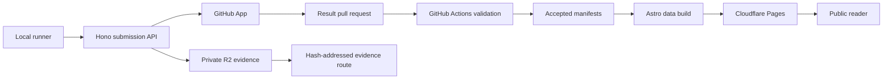

# LocalMax Public MVP Implementation Plan

## Goal
Build the first public LocalMax release from [LOCALMAX_CONCEPT.md](./LOCALMAX_CONCEPT.md). A user must be able to run one standard benchmark, inspect the collected data, submit it without a GitHub account, and view an accepted result on a useful comparison website.

The release must answer one question: **What can this system do with local AI?**

## Decisions and corrections
- Use one monorepo and the selected stack: Python runner, Astro and TypeScript website, and Hono on Cloudflare Workers.
- Ship three public categories: **LLM**, **Vision**, and **Video**. Rename the current “Diffusion” category because Wan is a video model and the proposed workload is video generation.
- Target one NVIDIA GPU with at least 12 GB VRAM. Support Linux first. Test WSL2 with Docker as a release candidate, but mark it experimental if it does not meet the repeatability gate.
- Build the LLM path first as an internal vertical slice. Do not open the public release until Vision and Video use the same protocol and publication path.
- Start under `pavel4ai`, per the repository policy: `github.com/pavel4ai/localmax.net` and `ghcr.io/pavel4ai/localmax-*`. Move to a project organization only after explicit approval.
- Use [Qwen3.5-4B](https://huggingface.co/Qwen/Qwen3.5-4B) as the release-candidate model for both text-only LLM and Vision profiles. It is a current Apache-2.0 multimodal model and reduces model download and runtime variation.
- Use [Wan2.1-T2V-1.3B](https://huggingface.co/Wan-AI/Wan2.1-T2V-1.3B) as the Video release candidate. Its official model card states an 8.19 GB VRAM requirement and recommends 480p for this variant.
- Use vLLM as the first LLM and Vision runtime candidate, [AIPerf](https://github.com/ai-dynamo/aiperf) as the pinned request and metric engine, and a dedicated Python adapter for Video. Freeze exact commits, flags, and model revisions only after tests pass on the 12 GB reference system.
- Publish raw metrics and profile-scoped ranks first. Do not publish one cross-category “LocalMax Overall” score in the MVP. Such a score would imply a comparison that the first data set cannot support.
- Do not add D1 in the MVP. Generate the site index from accepted manifests during the Astro build. Add D1 only if accepted results exceed 10,000, the generated index exceeds 25 MB, or a full site build exceeds five minutes.

## Scope
The public MVP includes:
- One immutable profile for each of LLM, Vision, and Video.
- One command per profile, with model caching, preflight checks, progress, time estimate, local validation, and a submission preview.
- System inspection and GPU telemetry.
- Versioned JSON Schema contracts for profiles, results, artifacts, and API requests.
- Project-signed OCI images and content-addressed evidence.
- Anonymous submission with an anti-abuse browser confirmation, R2 upload, GitHub App pull request, GitHub Actions validation, and automatic publication.
- Overall results, profile leaderboards, hardware pages, result pages, compatible comparison, methodology, data download, and release history.
- Public source, profile definitions, accepted manifests, formulas, known limits, and evidence references.

The MVP does not include:
- Native Windows or macOS runners, AMD, Intel, or Apple accelerators.
- User accounts, comments, social features, vendor programs, or paid certification.
- More than one profile per category.
- User-selected runtime flags in ranked results.
- A global score, quality competition, or overclocking competition.
- A database-backed read API unless the static index reaches the stated limits.

## Repository and contracts
Create the project baseline and keep each concern separate:
- `AGENTS.md`, `README.md`, `.gitignore`, `.env`, `.env.example`, code and data licenses, `SECURITY.md`, `PRIVACY.md`, and `CONTRIBUTING.md`.
- `src/localmax_runner` for the Python CLI, execution state machine, adapters, telemetry, evidence, signing, and submission client.
- `apps/web` for the static Astro site and small client-side filter, chart, and comparison components.
- `apps/api` for the Hono submission and evidence Worker.
- `schemas` for canonical JSON Schemas and API contracts. Generate Python and TypeScript types from these contracts or test hand-written types against them.
- `benchmarks/profiles` for immutable profile files, prompt sets, image assets, expected answers, runtime flags, and hashes.
- `containers` for a shared runner base and one released image per category.
- `results` for accepted manifests only. Keep logs, traces, and video samples out of Git.
- `tests`, `docs`, `scripts`, `tmp`, and `.claude/skills` as required project directories.
- `.github/workflows` for code checks, container release, submission validation, GPU conformance dispatch, and Pages deployment.

Use Apache-2.0 for project code. Use project-owned or compatible open assets for benchmark inputs. Define a separate open data license and submission grant before public intake.

## Protocol design
Each immutable profile file must define:
- Profile ID, semantic version, category, minimum hardware, expected run time, and compatibility rules.
- Model repository, immutable revision, file hashes, license, and download source.
- Container digest, runner version, runtime version, AIPerf revision where used, and every allowed flag.
- Input assets, prompts, seeds, request shape, warm-up, measured repetitions, timeout, and failure rules.
- Required raw files, metric definitions, telemetry interval, validation thresholds, and ranking keys.

Each result manifest must separate measured data from user labels and contain:
- Run and profile identity; model, container, runtime, and asset digests.
- Normalized GPU, CPU, RAM, OS, driver, CUDA, Docker, clock, power-limit, and cooling data.
- Raw request or generation measurements and derived metrics.
- Telemetry coverage and summary, artifact hashes, sizes, and media types.
- Verification state, validation findings, optional public alias, and timestamps.
- An Ed25519 public key and signature from the local installation. State clearly that this proves bundle continuity and integrity, not honest hardware.

Do not collect host name, user name, local paths, GPU serial number, environment values, unrelated process data, or stable hardware identifiers. Show the exact manifest and artifact list before upload.

## Release-candidate benchmark profiles
Treat these values as version `0.x` candidates. Freeze `1.0.0` only after conformance and license review.

### LLM 12 GB
- Model: Qwen3.5-4B at an immutable revision.
- Runtime: pinned vLLM with an OpenAI-compatible endpoint; AIPerf at a pinned commit.
- Interactive workload: 1,024 input tokens, 256 output tokens, concurrency 1, fixed synthetic inputs, and enough requests for p50 and p95.
- Throughput workload: the same token shape with a fixed concurrency sweep such as 1, 2, 4, and 8.
- Capacity check: 8,192 input tokens and 1,024 output tokens at concurrency 1, reported as pass or fail and not mixed into throughput rank.
- Main data: TTFT, inter-token latency, end-to-end latency, output and total token throughput, requests per second, peak VRAM, GPU power, GPU energy per output token, and throttle events.
- Rank within this exact profile by useful throughput under published TTFT and inter-token-latency limits. Keep interactive latency and efficiency as separate views.

### Vision 12 GB
- Model and runtime: the same pinned Qwen3.5-4B and vLLM base where possible; use AIPerf Vision support.
- Assets: a small project-owned or CC0 1080p set for OCR, chart reading, document reading, image description, and visual reasoning. Store source, license, expected answer, and hash for every asset.
- Workload: fixed prompts, fixed maximum output, concurrency 1 and 2, and repeat counts that keep the measured run under 15 minutes on the reference 12 GB system.
- Main data: TTFT, end-to-end latency, output tokens per second, requests per second, peak VRAM, GPU energy per request, and per-task values.
- Use deterministic answer checks for OCR, chart, and document items. A result must pass the quality floor before it receives a performance rank. Keep descriptive quality out of the score until a stable evaluator exists.

### Video 12 GB
- Model: Wan2.1-T2V-1.3B at an immutable revision.
- Runtime: the official or Diffusers path selected by a short bake-off, then pinned in the profile.
- Workload: 832 by 480, 16 fps, fixed frame count, fixed steps, guidance, shift, three project-owned prompts and seeds, no remote or local prompt extension, and fixed CPU-offload rules.
- Use one short compile and warm-up run, then measured full runs. Keep the complete benchmark under 60 minutes on the minimum reference system. Reduce frame count before profile freeze if this limit cannot be met.
- Main data: seconds per video, generated frames per second, per-prompt time, peak VRAM, peak system RAM, average and peak GPU power, GPU energy per video, and output hashes.
- Store one compressed sample per accepted run within a strict size limit. Do not publish a quality rank in version 1.0.
- Label this as a whole-system workload because CPU offload and system RAM affect the result. Label energy as GPU energy unless a supported whole-system meter is present.

## Runner implementation
Implement `localmax` as a state machine with resumable, visible stages:
1. `doctor`: verify NVIDIA driver, Docker GPU access, disk, RAM, network, and profile support.
2. `run PROFILE`: show downloads, expected time, collected fields, and allowed settings; then ask for confirmation.
3. Download the model into a mounted content-addressed cache and verify every required hash.
4. Start the pinned runtime, wait for readiness, run warm-up, run measured work, and sample telemetry with NVML and `psutil`.
5. Recalculate metrics locally, check telemetry coverage, redact output, and write a self-contained result directory.
6. `inspect RUN_ID`: show the exact manifest, evidence, warnings, and compatibility status without network access.
7. `submit RUN_ID`: obtain a one-time challenge, upload listed artifacts, complete the submission, and return a status and GitHub pull-request link.

Run containers without privilege, with dropped capabilities, a read-only root file system, and only explicit cache and output mounts. Sign released images with Cosign, publish an SBOM and provenance, and record the immutable image digest in every result.

## Submission, validation, and publication
Use this data flow:

Implement these API operations: create challenge, create submission, issue limited upload URLs, complete upload, read status, and retrieve accepted evidence by hash.

- Use a short browser confirmation with Cloudflare Turnstile for anonymous submission. The CLI opens the page and polls a one-time session. Do not require a user account or GitHub token.
- Upload individual declared artifacts. Do not make the Worker unpack an untrusted archive.
- Bind every object to the session, expected hash, size, media type, expiry, and one-time nonce.
- Keep R2 private. Serve accepted evidence through a read-only Worker route with safe headers and rate limits.
- Delete incomplete and rejected uploads after seven days. Keep accepted evidence while the result is public. Add cost alerts, per-run limits, per-IP limits, and a documented removal process.
- Let the GitHub App create a branch and pull request only after Worker checks pass. Give it access only to result paths and pull-request operations.
- In GitHub Actions, validate schema, signatures, profile and container digests, hashes, required evidence, metric recalculation, telemetry coverage, plausible ranges, duplicate content, and secret patterns. Never execute submitted files.
- Auto-merge normal valid submissions after all checks. Require review for records, anomalies, repeated failures, or policy flags. Preserve submitted values; reject or annotate them, but never rewrite them silently.

Use two public verification states in the MVP:
- **Community:** valid manifest, but missing full evidence or produced by a supported local import. Show it as unranked.
- **Verified:** official signed image, immutable profile, complete evidence, and all automated checks passed. Include it in ranks.

Defer Certified. State that Verified checks protocol compliance and evidence consistency; it does not prove operator honesty.

## Information-rich website
Adopt the useful audit pattern from [InferenceX](https://inferencex.semianalysis.com/): pinned public recipes, visible raw data, and direct links from a result to its source. Do not copy its layout, styles, components, wording, or visual identity. The [benchmark source](https://github.com/SemiAnalysisAI/InferenceX) and [dashboard source](https://github.com/SemiAnalysisAI/InferenceX-app) are references for openness, not templates.

Use an original utility-focused design:
- Lead with a hardware and profile finder, not a marketing wall.
- Use server-rendered summaries, native tables, URL-based filters, and small progressive-enhancement components.
- Put plain-language headline results first. Put exact configuration, raw requests, telemetry, and evidence in clear detail sections.
- Use category labels and an accessible neutral palette. Do not use vendor logos as the main navigation or copy InferenceX chart composition.
- Keep tables primary and charts explanatory. Every chart must expose the source values and a data download.

Implement these routes:
- `/`: project promise, run action, supported hardware, recent verified results, and direct category entry.
- `/results`: all accepted results with URL-backed filters for profile, GPU, VRAM, driver, runtime, verification, and stock or tuned state.
- `/benchmarks/{profile}`: profile rules, compatibility, leaderboard, latency-versus-throughput plot, efficiency plot, and known limits.
- `/hardware/{gpu}`: compatible profiles, result distributions, common configurations, and all systems that use the GPU.
- `/results/{run-id}`: headline metrics, per-workload values, telemetry timeline, complete system and software configuration, validation findings, artifact hashes, raw manifest, evidence links, and source pull request.
- `/compare?ids=...`: compare two to four results; default to the same profile and version, and show a strong warning for incompatible data.
- `/run`, `/methodology`, `/data`, `/releases`, and `/privacy`: concise operating and trust documentation.

Generate a normalized result index and aggregates from `results` during the build. Validate all source manifests before Astro can build. Keep filter state shareable in the URL. Set accessibility, responsive layout, and a small JavaScript budget as release gates.

## Delivery sequence and gates
### 1. Foundation and benchmark RFC
- Bootstrap the monorepo, toolchains, licenses, project rules, CI, contracts, ADRs, and safe local configuration.
- Correct the concept conflicts: Video naming, 12 GB profiles, verification meaning, profile counts, and score policy.
- Run a short model and runtime bake-off on at least one 12 GB GPU. Record fit, start time, run time, output stability, and license status.
- Exit: all three `0.x` profiles validate against schema, fit the target in a prototype, and have no unresolved license or data-source issue.

### 2. Local LLM vertical slice
- Build the shared runner, LLM adapter, telemetry, local evidence, schema validation, and first OCI image.
- Run at least three full repetitions on each available reference system.
- Exit: speed and latency coefficient of variation is at most 3%, GPU energy variation is at most 5%, telemetry coverage is at least 99%, and a second operator can repeat the run from the documentation.

### 3. End-to-end publication slice
- Add the Worker, R2 sessions, local submission preview, GitHub App flow, validation workflow, accepted result storage, and one result page.
- Test normal, interrupted, duplicate, oversized, malformed, stale, and secret-containing submissions.
- Exit: a clean LLM run moves from a new machine to a published page without a manual database change; rejected evidence expires as designed.

### 4. Vision and Video adapters
- Add licensed Vision assets, deterministic quality gates, the AIPerf Vision adapter, the pinned Video adapter, output sampling, and category-specific validation.
- Reuse the runner, manifest, telemetry, submission, and publication contracts. Do not fork category-specific copies of the platform.
- Exit: each profile passes its duration, memory, repeatability, evidence, and independent-operator gates on the 12 GB baseline.

### 5. Discovery website and public beta
- Complete all routes, filters, charts, compatible comparison, source links, downloads, documentation, status handling, and privacy text.
- Seed results from several GPU classes, with at least two independent systems for each profile. Do not launch a leaderboard with only one system.
- Exit: external users can choose a profile, run it, understand failures, inspect collection, submit, follow status, and compare accepted results.

### 6. Version 1.0 hardening
- Freeze profile `1.0.0` files and container digests. Publish release notes, compatibility rules, hashes, licenses, known limits, support period, and rollback steps.
- Run security, recovery, accessibility, and performance checks. Exercise restore from GitHub manifests and R2 inventory.
- Exit: all acceptance criteria below pass and no critical benchmark, privacy, or publication defect remains open.

## Validation plan
- Python: `pytest`, Ruff, type checks, parser golden files, metric property tests, redaction tests, and deterministic manifest tests.
- TypeScript: strict type checks, Vitest, Astro checks, Hono route tests, contract fixtures, and build tests.
- Cross-language: validate the same good and bad fixtures in Python, Worker, and GitHub Actions.
- Local integration: use Wrangler local R2 and a fake GitHub API; cover retries, expiry, idempotency, partial uploads, and Worker restart.
- Browser: Playwright for run guidance, filters, result details, comparison, evidence links, accessibility, keyboard use, and mobile-width rendering.
- Supply chain: dependency lock files, container vulnerability scan, SBOM, signed images, provenance, and secret scan.
- GPU conformance: manual or self-hosted tests on a 12 GB minimum system and at least two other NVIDIA GPU classes. Keep raw conformance artifacts.
- Recovery: rebuild every website record from accepted manifests, reconcile R2 hashes, and redeploy to a clean Cloudflare environment.

## Completion criteria
- A new user can complete each profile from the published instructions without editing code or runtime flags.
- Each profile fits the 12 GB baseline and stays within its published time and disk requirements.
- Repeatability meets the stated thresholds on reference systems and an independent operator reproduces each path.
- Every ranked value is reproducible from public raw metrics and an immutable profile.
- Every accepted result has a public manifest, source pull request, verification explanation, and retrievable evidence.
- The website gives raw latency, throughput, memory, power, and configuration at least as much importance as rank.
- No submitted secret, user path, host name, or stable hardware identifier appears in public fixtures or end-to-end tests.
- GitHub remains the canonical result source, R2 contains no orphaned permanent uploads, and a full static index rebuild succeeds.

## Main risks
- **12 GB fit:** Runtime overhead can make even a 4B multimodal model fail at long context. Freeze the model, precision, context, and concurrency only after real 12 GB tests.
- **Video duration:** A useful 480p run can be too slow. Keep three fixed samples, set a 60-minute baseline limit, and reduce frame count before `1.0.0` if required.
- **CPU-offload bias:** Video measures more than the GPU. Record CPU and RAM, label it as a system result, and do not claim whole-system energy from NVML.
- **Untrusted submissions:** Containers and signatures do not prove honesty. Use clear verification wording, anomaly review, public evidence, and no silent correction.
- **Model and runtime churn:** Pin immutable revisions and never change a released profile in place. Publish a new major profile when comparison changes.
- **Low initial coverage:** Recruit seed operators before launch. A sparse leaderboard is not yet a useful product.
- **Windows adoption:** Many local-AI users use Windows. Test WSL2 early and publish exact limits even if native Windows stays out of scope.
- **Storage and PR growth:** Enforce evidence limits and lifecycle rules. Split results into a separate repository only when permissions, Git size, or PR volume justify it.
