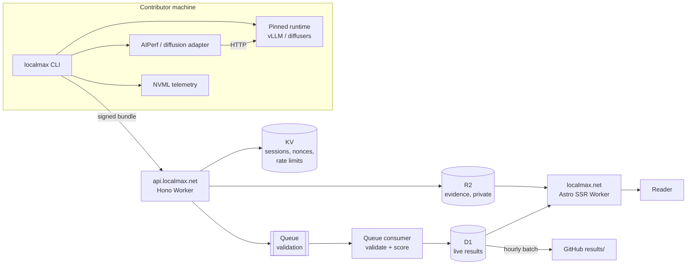

# LocalMax architecture

Authoritative design. Supersedes `LOCALMAX_CONCEPT.md` and `LOCALMAX_IMPLEMENTATION_PLAN.md`
wherever they disagree; those documents are retained as the original vision and first plan.

## 1. Decisions that shape everything else

| # | Decision | Why |
|---|---|---|
| 1 | **Three VRAM tiers per category**, not one profile | A single 4B profile across 12 GB → 192 GB measures memory bandwidth and nothing else. The second RTX PRO 6000 would sit idle and DGX Spark would rank below an RTX 3060. |
| 2 | **Three quantization lanes**, separately ranked | FP8 is the modern default and needs Ada or newer. INT4 reaches furthest and is the only lane an RTX 3090 can enter. NVFP4 is Blackwell-only. Ranking them together would compare different numerical workloads. |
| 3 | **Diffusion is text-to-image in v1**, video deferred | T2I is compute-bound, the exact inverse of the bandwidth-bound LLM test, so it is the counterweight that stops the site being one bandwidth chart in three costumes. It also runs in ~30 s, which is what populates a leaderboard. |
| 4 | **D1 is the live store; Git is a batched archive** | A pull request per submission cannot absorb thousands of concurrent users. See §4. |
| 5 | **Prefill and decode throughput are reported separately** | This is the metric that distinguishes compute-rich from bandwidth-rich hardware. TTFT alone conflates prefill with scheduling overhead. |
| 6 | **Energy is typed, not just measured** | `gpu_board_w` on a discrete card and `soc_module_w` on GB10 are different physical quantities. They are never ranked against each other. |
| 7 | **arm64 is a first-class target** | DGX Spark is GB10/aarch64. Every container is multi-arch from day one; retrofitting is worse. |
| 8 | **Home hardware is the scope** | LocalMax may accept a data-centre result but reserves the right not to show or rank it. Stating the boundary once is better than a contributor discovering it after a run. |
| 9 | **Identity is generated, never typed** | A machine is published as `Rocinante-K7X2P`, derived from a key that never leaves it. There is no free-text name field, because a field that exists eventually holds something identifying. The five-character code is the contributor's own handle at `/systems/CODE`. |

## 2. The profile matrix

A **profile** is the unit of comparability. Two results are ranked together only when every
one of these keys matches:

```
category · tier · lane · profile_version · runtime · runtime_version · gpu_count · parallelism
```

Tier is defined by the VRAM the ranked run is meant to *fill*, so each lane gets a model
sized for that tier rather than leaving the card idle. Tier comes from **total VRAM across
the whole system** — every GPU, across every node. Two RTX PRO 6000 cards and eight DGX
Sparks are each one Prospector system.

### LLM

| Profile ID | Tier | Min VRAM | Model class | Precision | Runs on |
|---|---|---|---|---|---|
| `llm-entry-fp8` | Entry | 12 GB | 4B | FP8 | Ada+ |
| `llm-entry-int4` | Entry | 12 GB | 8B | INT4 (AWQ) | Ampere+ (includes RTX 3090) |
| `llm-entry-nvfp4` | Entry | 12 GB | 8B | NVFP4 | Blackwell |
| `llm-enthusiast-fp8` | Enthusiast | 24 GB | 8B | FP8 | 4090, 5090, ↑ |
| `llm-enthusiast-int4` | Enthusiast | 24 GB | 32B | INT4 (AWQ) | 3090, 4090, 5090, ↑ |
| `llm-enthusiast-nvfp4` | Enthusiast | 24 GB | 32B | NVFP4 | 5090, RTX PRO 6000, GB10 |
| `llm-prospector-fp8` | Prospector | 64 GB | 32B | FP8 | GB10, RTX PRO 6000, clusters |
| `llm-prospector-int4` | Prospector | 64 GB | 72B | INT4 (AWQ) | GB10, RTX PRO 6000, clusters |
| `llm-prospector-nvfp4` | Prospector | 64 GB | 72B | NVFP4 | GB10, RTX PRO 6000, clusters |

The Prospector model is a 32B at FP8 on purpose: it fits both DGX Spark's 128 GB unified
memory and a 2×96 GB workstation. A 70B model would exclude Spark from its own tier.
A cluster counts as one system — LocalMax adds the VRAM of every node.

Vision and Diffusion follow the same tier and lane structure. Vision reuses the LLM tier
models where they are multimodal, so a contributor downloads one set of weights.

Ampere has no FP8 hardware, so an RTX 3090 cannot enter the default lane at all. INT4 is the
lane with the widest reach and is where those cards appear. The site states this wherever a
lane is offered, rather than leaving a 3090 owner to infer it from an empty leaderboard.

### Fixed inputs

Everything that could change a number is pinned in the profile file and hashed:

- **LLM** — ISL 1024 / OSL 256 interactive at concurrency 1; the same shape swept at
  concurrency 1, 2, 4, 8; a long-context pass at ISL 8192 / OSL 1024 reported pass/fail.
- **Vision** — a fixed image set at fixed resolution, fixed prompts, fixed max output, with
  deterministic expected answers for OCR, chart and document tasks.
- **Diffusion** — fixed model, 1024×1024, fixed scheduler, step count, guidance, batch size,
  and a fixed seed set. Ranked on **seconds per step**; images/minute is derived.

### Launch set

Nine leaderboards, not twenty-seven — the FP8 lane, plus the two most popular INT4:

```
llm-entry-fp8 · llm-enthusiast-fp8 · llm-prospector-fp8
vision-entry-fp8 · vision-enthusiast-fp8
diffusion-entry-fp8 · diffusion-enthusiast-fp8
llm-entry-int4 · llm-enthusiast-int4
```

A leaderboard is published only once it has results from ≥2 independent systems. The schema
supports the full matrix from day one; publication is gated on population.

## 3. Components



## 4. Why Git is not in the write path

The original plan opened a pull request per submission. At the stated target — thousands of
concurrent users — that fails on three independent limits: the GitHub REST secondary rate
limit, contention on a single branch, and Actions queue depth. It would also make publication
latency unbounded during a spike.

Instead:

1. The Worker validates cheaply and synchronously (schema, signature, nonce, declared sizes),
   then **enqueues** and returns `202` with a status URL. This path is O(1) and does no I/O
   beyond KV and a queue send.
2. A queue consumer does the expensive work — hash verification against R2, metric
   recomputation from raw records, telemetry coverage, plausibility, duplicate detection —
   and writes the result to D1 with its verification state. Retries and a dead-letter queue
   are handled by the platform.
3. A scheduled job batches every newly accepted result **since the last archive** into a
   single commit to `results/`, hourly. Git stays the durable, auditable, rebuildable record;
   it is simply no longer in the critical path.
4. D1 is rebuildable from `results/` at any time. `scripts/rebuild-index.mjs` does this.

Read scale is handled separately: the site is SSR on Workers with edge-cached responses and
a stale-while-revalidate policy, so a leaderboard is served from cache to almost every
reader. Cache keys include the profile and filter state, and are purged on archive.

## 5. Verification states

- **Community** — valid manifest and signature, but incomplete evidence or an unofficial
  image. Displayed with all raw values. Never ranked.
- **Verified** — official signed image digest, frozen profile, complete evidence, telemetry
  coverage ≥99%, all derived metrics recomputed and matching within tolerance. Ranked.

Certified (independent re-run) is deferred.

## 6. Storage model

| Store | Holds | Durability |
|---|---|---|
| D1 | Normalized results, metrics, hardware registry, aggregates | Rebuildable from Git |
| R2 | Raw records, telemetry traces, system reports, diffusion samples | Authoritative for evidence; hash-addressed |
| KV | Submission sessions, one-time nonces, rate-limit counters | Ephemeral, TTL'd |
| Queue | Pending validation jobs | Platform-managed, DLQ on repeated failure |
| Git | Accepted manifests | Canonical archive |

Evidence is addressed by SHA-256 of its content, so an artifact referenced by two results is
stored once, and a manifest cannot drift from its evidence.

## 7. Client JavaScript budget

30 kB gzipped for the entire site. Charts are hand-written inline SVG rendered on the server.
The only islands are the results filter, the comparison picker, and the theme toggle. There
is no chart library, no analytics, and no font CDN.
